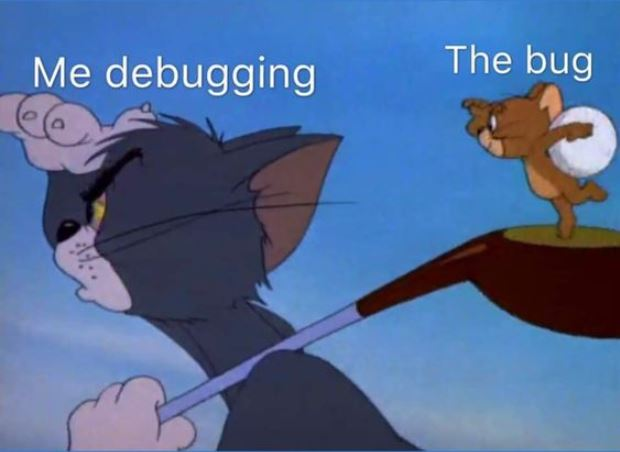
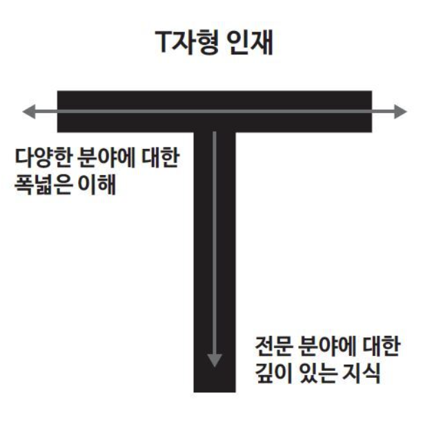
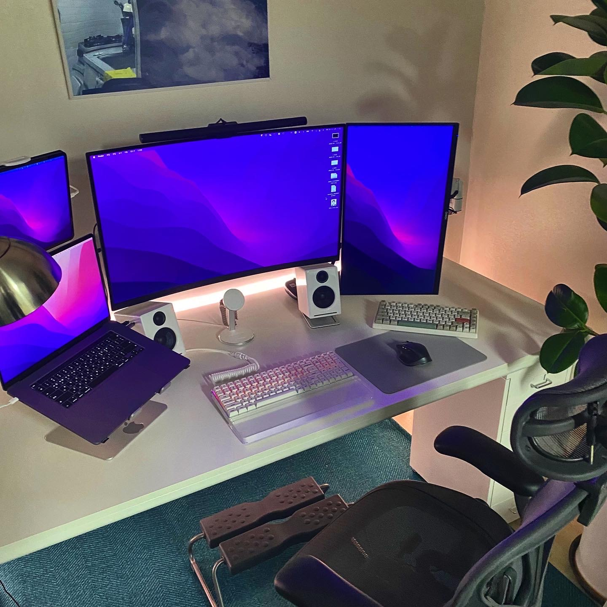
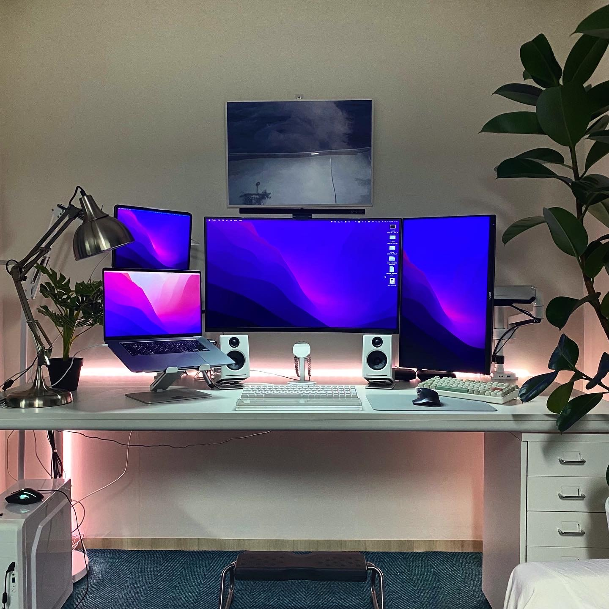
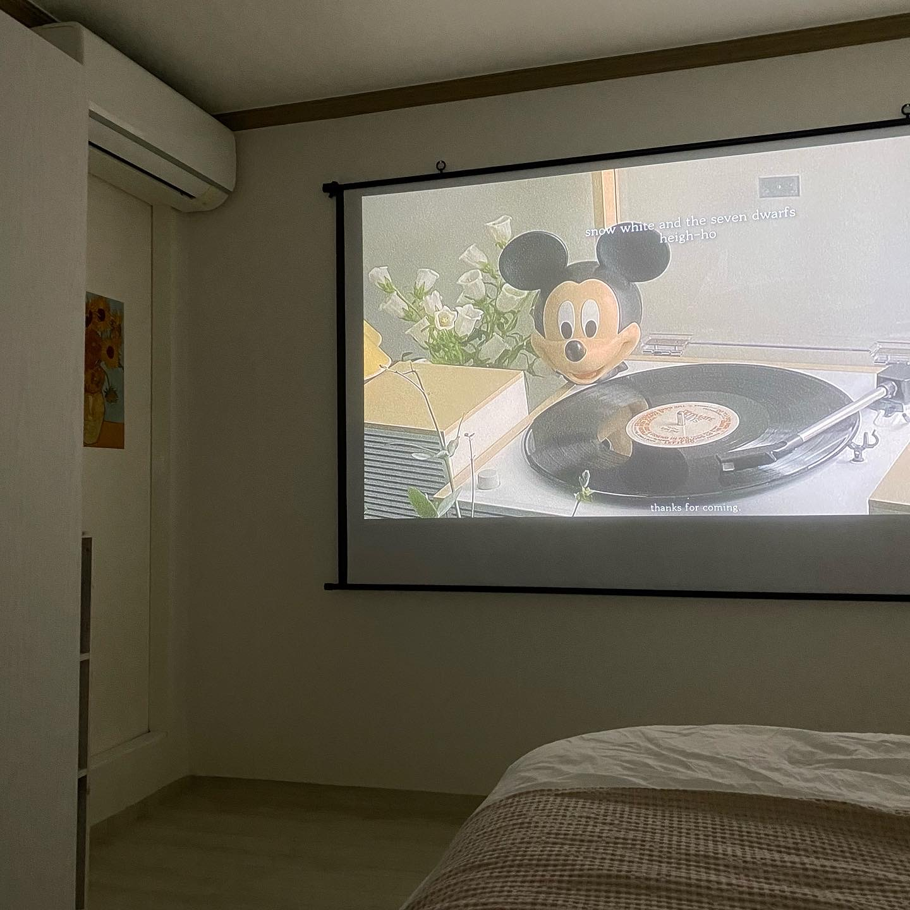
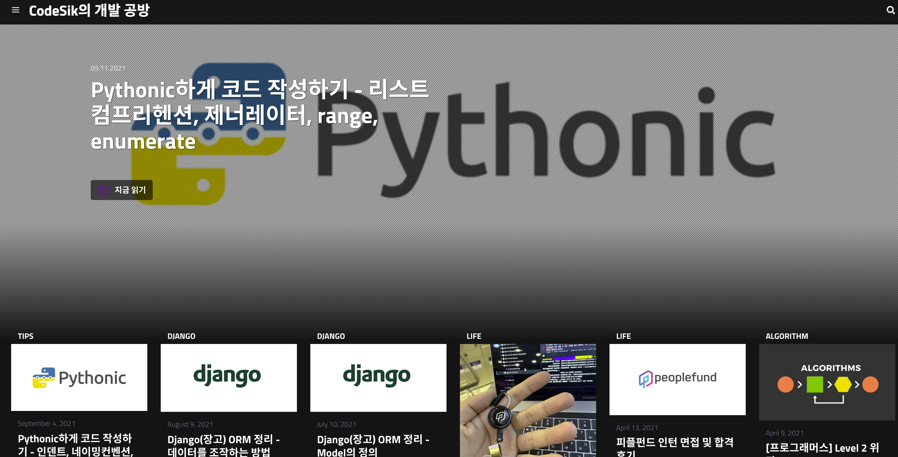
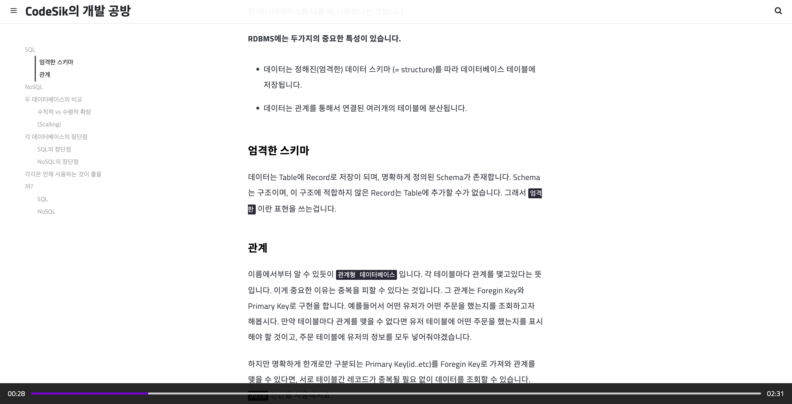
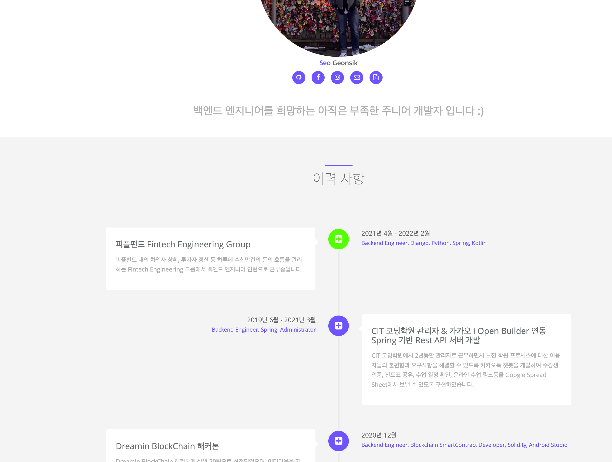
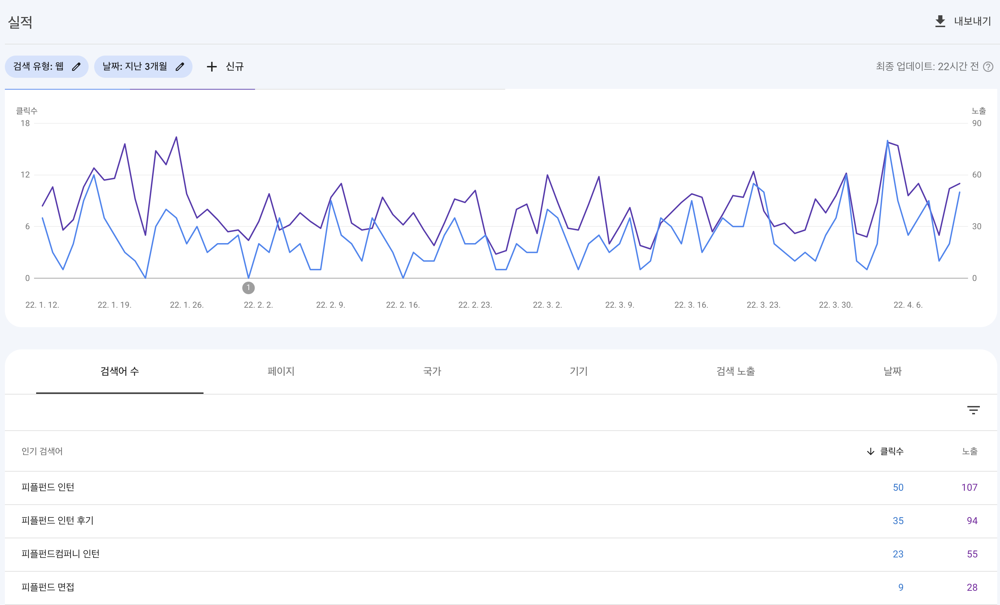

# 근황

2021년 4월부터 일했던 회사에서 2월부터 정규직 제안을 받았다. 원래 계약기간이 2월까지였고, 막학기를 앞두고 있었기에 당연히 퇴사를 염두에 두고 있었는데, 좋은 조건을 주셨고 주 1회 출근으로 배려를 해주셔서 회사와 학교를 병행하고 있다.

오랜만에 학교를 가니까 22학번도 많았는데, 너무.. 화석같다..
하지만 계속 비대면만 해왔었는데 대면으로 학교를 나가니, 막학기를 대면으로 할 수 있음에 감사한 것 같다.
(`I라서 비대면이 좋긴하다`)

2021년도의 나를 되돌아보고 계획했던건 잘 지켰는지,
좋은 개발자로 일하고 있는지에 대해서 한번 생각해보려고 한다.

---

## 2021년

__솔직히 2021년을 치열하게 살았다고는 못할 것 같다.__

2021년에는 휴학을 결정했다. 인턴을 구해서 처음으로 현업에서 일해보고 싶어 휴학을 결정하기도 했지만 개인적으로 힘든일도 있었기에 6개월 정도는 나를 돌아볼 시간이 좀 필요했다. 하지만 생각보다 빠르게 일을 구해버렸다. 2021년 4월 말 부터 일을 시작했는데, 일을 시작하면서 다짐했던 일들을 많이 지키진 못했다. 그동안 많이 지쳐있던 것 같다.

물론 이전의 나와 비교한다면 많이 성장했다고 스스로도 느끼고 있다. 다만 완벽주의자지만 게으른..? 나의 성격상 만족하지는 못한다. 퇴근 후에도 공부하는 습관을 4개월 정도는 잘 들였던 것 같은데, 그 이후로는 지쳐서 쉬기 바빴던 것 같다. 특히 `2021년 네이버 하반기 공채` 에서 코딩테스트와 서류를 합격하고, 이어진 1차 면접에서의 쏟아지는 수학문제에 정신 못차리고 떨어지고 나니, 뭔가 자존감도 떨어지고 의지가 약해졌었다. (그때 당시는 퇴사를 염두하고 있었다.)

다만 정규직 제안을 받을 때 들었던 나에 대한 평가, 인정하는 부분에 대해서 직접 듣게 되었을 때 그래도 많은 자신감을 얻었다. 그동안 내가 회사에서, 좋은 개발자로 일하고 있었는지에 대한 확신이 없던 상태에서 들으니 많이 듣고싶던 말 이었나보다. 아직은 내가 헤쳐나가고 해결해나가는 문제들이 적절한 시기에 훌륭하게 풀어 냈는지에 대한 여부를 판단하기엔 경험이 부족한 듯 했다. 그래도 작년의 나와 비교하면 어느정도 눈이 생겼다고 생각한다.

물론 나의 기준이지만, 상관없다. 맞든 틀리든 내 주관이 생겼다는 것에 만족한다.

## 응애 애기 개발자



회사에서 일한지 지금 시점에서 거의 1년이 다 되어간다.
처음 들어갔을 땐 `Python`도 평소에 쓰던 언어가 아니라서 익숙하지 않았었고, `Django` 프레임워크도 처음 접해봤다. 그래서 지금 예전에 인턴 후기로 썼던 글을 보면 뭔가 귀엽다. 그때는 뒷단에서 내가 다루는 서버가 이 서비스의 전부라고 생각했었던.. 귀여운 발상도 했었다. 물론 대부분을 담당하고 있기는 하지만..

회사에서도 지나서 생각해보면 참 많은 부분을 담당했던 것 같다. 크고 작은 PR을 108개 정도 생성했었고, 내가 개발한 Feature들이 많이 반영이 되었다. 특히 대외기관과 연동하는 업무를 많이 진행했다. (우리가 클라이언트 일때도 있고, 서버일 때도 있었다.) 그 과정에서 네트워크 단에서 어떻게 연동하고 업무가 처리되는지도 알 수 있었고, 대외기관과 직접 연락하고 테스트 해보면서 프로젝트를 관리하는 방법도 배운 것 같다. 끝내 배포가 나갔을 땐 참 짜릿했던 것 같다.

지금은 정말 그래도 `개발자` 라고 불릴 수 있는 수준까지는 됐다고 생각한다. 하지만 `좋은 개발자` 인지에 대해서는 계속해서 생각해볼 문제이다. 자신이 좋다고 판단해버리면 발전이 어렵지 않을까..? 끊임없이 좋은 개발자란 무엇일까 생각하면서 발전해 나가는게 좋을 것 같다.

### 좋은 개발자

물론 아직.. 일한지는 뭐 1년차지만 경력은 2개월차 완전 주니어 개발자의 생각이긴 하다. 맞을수도, 틀릴수도 있지만 그냥 내 생각을 적어보려 한다.

> __실력__

실력에 대해선 두말할 것 없이 중요하다. 사실 개발자라는게 현실의 문제를 해결하기 위해 그것을 해결하기 위한 어떤 시스템이나, 소프트웨어를 잘 `만드는` 직업이기 때문에 Problem Solving을 잘하는게.. 개발자가 갖춰야 하는 1순위의 역량중 하나이다.

__다만, 실력이 좋다 == 좋은 개발자다__ 는 아니다.

> __협업 스킬__

거의 모든 소프트웨어는 혼자 개발하지 않는다. 반드시 `'협업'`을 한다. 여기서 말하는 협업은 단순히 개발자끼리 필요한 협업 스킬들(컨벤션이나, 브랜치 전략, 코드 리뷰 등등..)만을 말하는 것이 아닌 넓은 개념이다. 개발자 - 개발자 사이에서도, 개발자 - PO(PM) 사이에서도, 개발자 - 대외기관 담당자, 심지어는 고객과도 같이 만들어나간다.  

이렇게 많은 사람들과 협업하며 제품을 만들어가는 과정에서, 내가 만드는 이 제품에 대한 태도가 좋은 개발자인지 아닌지를 결정한다고 생각한다. 그건 바로 `OwnerShip` 이다.

나는 기획자와 개발자의 기준이 모호할 때 좋은 개발자라고 생각한다. 그 말은, 개발자가 이건 기획자의 일이다, 내 Scope가 아니다 라고 선을 긋는 순간 실력이 성장하는 면에서나 제품을 바라보는 시선에 한계가 생긴다고 생각한다.

제품에 대한 주인의식을 가지고, 주어진 Task를 능동적으로 처리할 수 있는 태도를 갖추는 것이 중요하다. 기획도 사람이 하는 것이고 정책 또한 사람이 결정한다. 그렇기 때문에 항상 옳은 결정이 내려지지는 않는다. 오히려 현업에서는, 정책이나 기획의 방향성을 수정하면 굳이 개발하지 않아도 되는 일들이 종종 있다. 그런 경우에는, 그냥 하라고해서 개발하는 것 보다 정책과 기획을 수정하는 것이 개발 리소스를 줄이는 방법이다. 이러한 눈을 키우려면 주어진 일만을 처리하려는 태도가 아닌 `주인의식`을 가지고 능동적으로 이 일이 왜 부여 됐는지, 다른 방향성은 없을지에 대해 계속 고민하는 자세가 필요한 것 같다. 더 나은 방향으로 일을 처리할 수 있는 시야가 생기기 때문이다.


> __팔방미인__

개발자의 이상적인 공부의 방향성..? 이라고 하면 흔히 말하는 `T자형 인재` 인 것 같다.



회사에서 보면 다양한 부분에서 두각을 나타내시는 분들이 있다. 여러 부분에서 많이 태그를 당하시고(ㅎㅎ), 뚝딱 해결하시는 팔방미인 같은 분들을 보면 참 배우고 싶다는 생각이 든다.

이런 분들을 보면 다양한 서버에서 코드를 작성하고, 인프라적 지식도 어느정도 있고(AWS), 배포 전략 및 자동화에 대해서도 잘 알아 직접 환경을 구축하거나.. 등등 비즈니스 로직만 잘 짜는게 아니라 다양한 부분에서 지식을 가지고 있다.

이런 유형의 개발자, 즉 T자형 인재들이 좋은 개발자라고 생각한다. 결국 이러한 방향성을 가지고 성장해 나가는 것이 나중에 시니어 개발자가 되었을 때 좋은 아키텍쳐를 설계할 수 있는 기반을 만들어 줄 것이라고 생각한다.


> __좋은 동료__

당연하지만 좋은 개발자이기 이전에 좋은 동료부터 되어야 한다. 이거야 뭐.. 굉장히 많은 요소가 있겠지만 가장 중요하게 생각하는건 누구를 탓하지 않는 것이다. 나 때문에 발생하지 않은 문제 이더라도 적극적으로 나서서 같이 해결해보고, 이런 자세들이 좋은 동료가 될 수 있지 않을까 생각한다. 술도 자주 먹으면 좋을 것 같다.


## 인테리어

21년 10월에 이사를 했다. 무려 4평 -> 12평으로 3배나 성장했다..! 하지만 가격은 그대로였다.

INFP 면서 극 I 극 F라 집에있는 시간을 매우 소중히 여긴다. 그래서 집을 꾸며놓는 걸 너무 좋아한다.

인테리어는 나름 성공적인 것 같다. 특히 업무환경이.. 너무 마음에 든다.



옆에 있는 고무나무는 회사가 이사를 하면서 받은 건데, 이름은 루피로 지었다. 고무나무라서..




원래 빔프로젝터는 있었는데, 집이 커지다 보니까 사이즈가 120인치가 됐다. (너무.. 너무 좋다.)
최근에는 스위치로 포켓몬스터 아르세우스를 클리어 했다. 포켓몬 너무 귀여워

## 블로그

블로그는 최근 `jekyll` 기반에서 `gatsby + github pages` 조합으로 바꿨다. jekyll은 루비로 짜여져 있어서 내가 커스텀하기엔 너무 버겁다. 하라면 할 순 있겠지만 포스팅에 시간을 쓰는게 아닌 블로그 커스터마이징 하는데 너무 오랜 시간을 쓰는건 큰 의미가 없는 것 같았다.

그래서 내가 조금은 써본 리액트로 커스터마이징 할 수 있는 gatsby 기반 테마를 쓰기로 했고, zoomkoding님의 테마를 수정해서 썼다. 아주 잘 만들어 놓으셔서 나중에 기능 추가하는데에도 쉽게 할 수 있을 것 같다. 프론트도 재밌다..ㅎ

(원래 블로그.. 이쁘긴 했어서 아쉽다. 포스팅에 남겨놓는다.)






포스팅을 자주 올리지는 못했다. 퇴근하고 블로그 글쓰는게 참 쉽지가 않다. 소재는 많이 적어놨는데..ㅠ.ㅠ 기술 블로그를 꾸준히 운영하는건 정말 대단한 일인 것 같다. 대단한 사람이 되도록 노력하자..

그래도 혼자 지식을 알고 있는 것과, 남에게 설명하기 위해 고민하고 글을 작성하는 것은 그 깊이가 다르다고 글을 작성할 때마다 느낀다. 또 이렇게 지식을 전달하고 소통하는 것도 재밌다.


[카카오 오픈빌더 챗봇 API 서버 프로젝트](https://codesik.github.io/Kakao-OpenBuilder-RestAPI-Server/) 에 오픈빌더를 개발하시는 분이 덧글을 달아주셔서 신나게 답변을 드렸던 기억이 있는데, 다시 찾아오시진 않으셨다. 이분이 지인들 외엔 첫 댓글이 었는데.. 소통하는게 너무 재밌었다. 다음에 또 와주세요..

그 외에 회사에 들어온 인턴분들이 나의 블로그 글을 보고 오신분들이 꽤 많았다.. 아무 생각 없이 적었던 글들인데, 나름 회사에 긍정적인 영향을 주고 있는 것이라고 믿고 따로 지우려고는 하지 않고있다. ~~사실 대부분의 유입이.. 그 글이라서 그런건 아니다..~~

이건 사실 좀 슬프다. 내 기술글이 상위에 노출 되려면 글을 잘써야겠지.. 잘 써야겠다.



## 공부

알고리즘 공부는 매일 한건 아니지만 그래도 꾸준히 조금씩 해와서 많이 익숙해지고 실력이 늘었다. 앞으로도 취업한 상태이지만 알고리즘 공부는 꾸준히 해야할 것 같다.

작년엔 회사에서 사용하는 기술 스택, 도메인, 아키텍처에 대해서 공부를 많이 했다. 그 외 개인적인 공부는 CS를 복습했던 정도..? 아, 코프링 관련해서 회사에서 스터디를 해서 Bidding system을 간단하게 만들었었다.

올해는 개인적인 공부도, 사이드프로젝트도 잘 해내야겠다. 작년에는 너무 게을렀던 것 같다. 보통 이런글에는 솔직하게 안쓰기 마련인데.. 솔직하게 공개해놔야 올해는 잘하지 않을까 싶다

## 마치며

올해는 공부도 열심히 하고, 득근도 하고, 좋은 개발자가 되는 한 해가 되었으면 좋겠지만 하나라도 제대로 성공하면 좋겠다 ㅎㅎ

그리고 제발.. 올해는 코로나 없어지고 해외여행을 떠나고싶다 ㅠ.ㅠ

이건 여담이지만, 학교를 졸업하기 전에 창업하고 싶다는 생각이 너무 커지고 있다. 더 늦기전에 CEO는 한번 해봐야 하지 않을까..?! 학생 신분일 때 얻을 수 있는 혜택이 많아서.. 아직은 생각만 하고있다.

그럼 올해도(4월이지만..) 화이팅! 🤓🤓


```toc
```
