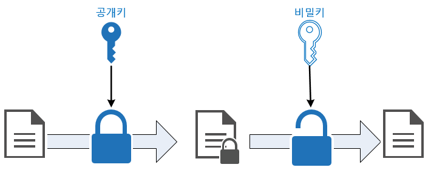

<p class="callout"> 💡[Security] 비대칭 암호화와 RSA 알고리즘 </p>
## 비대칭 암호화

비대칭 암호화는 암호화, 복호화에 사용하는 키가 2개인 암호화 방식을 의미합니다.

그 키는 Public Key, Private Key로 나뉩니다.

일반적으로 Public Key는 자물쇠, Private Key는 그 자물쇠에 맞는 열쇠라고 생각하면 편합니다.

다만 Public Key, Private Key 둘 다 서로 암호화, 복호화에 사용할 순 있습니다. 일반적으로 그렇다는 겁니다.



> 출처: codedragon.tistory.com

### 방식

만약에 A 서버와 B 클라이언트가 정보를 교환한다고 해봅시다.

A는 B에게 공개키를 제공합니다. 그리고 B가 정보를 보낼 때 공개키로 암호화를 해서 보냅니다.

이렇게 되면 B가 보낸 정보는 A의 개인키로 밖에 열지 못하기 때문에 유출되더라도 위험하지 않으며

A에게만 비공개적으로 정보를 보낼 수 있는 것입니다.

### HTTPS

HTTPS 프로토콜 상에서 통신하는 A 서버와 B 클라이언트가 서로 정보를 교환해야 한다고 가정해봅시다.

>HTTPS란?<br>
SSL 프로토콜위에서 동작하는 HTTP. 서버가 SSL 인증서를 CA 기관에서 발급받아 정보를 안전하게 교환할 수 있도록 보안성을 높인 프로토콜이다.

먼저 서버는 CA기관으로 부터 SSL 인증서를 발급받습니다.

CA에게 공개키를 제공하고, CA는 A의 공개키를 인증기관의 개인키로 암호화합니다.

그리고 CA에서 발행한 공개키를 통해 이 것을 복호화 하면 인증서에 대한 해쉬값을 얻을 수 있습니다.

인증서에 등록된 해쉬값과 CA에서 발행한 공개키로 서명값을 복호화해서 나온 것이 서로 동일하면 인증서의 내용과 공개키가 위,변조 되지 않았음을 보증할 수 있습니다.

클라이언트의 브라우저로 서버에 접속하게 되면, 서버에서 인증서를 사용자에게 제공합니다.

브라우저가 인증서를 발급한 기관이 브라우저에 등록된 인증기관 리스트에 있는지 확인하고, 인증기관의 공개키를 통해 제공받은 인증서를 복호화합니다. 복호화가 성공하게 되면 인증이 완료되는 것이죠.

### 블록체인

블록체인에서 자신의 Transaction에 Sign을 할 때도 같은 방식이 사용됩니다.

트랜잭션을 발생시킨 공개키가 자신의 트랜잭션이다 라는 것을 자신의 개인키로 서명해야만 트랜잭션이 전송되어 블록체인 네트워크에 기록되는 것입니다.

블록체인에서의 협의 방식은 HTTPS 처럼 인증 가능한 기관이 있는 것이 아닌 `Proof of Work(POW)` 매커니즘을 통해 이뤄집니다.

간단히 설명하자면 그렇게 서명하여 보낸 트랜잭션이 Valid한지 블록체인 네트워크에 등록된 노드들이 검사를 하는 매커니즘입니다.

### RSA 알고리즘

비대칭 암호화를 구현하기 위한 대표적인 알고리즘은 RSA알고리즘 입니다. 공개키와 개인키를 생성하기 위한 알고리즘 입니다.

공개키는 n,e / 개인키는 n,d 라는 각각 두 정수로 이뤄져 있습니다.

구하는 알고리즘은 다음과 같습니다.

- p ≠ q인 두 소수 p와 q를 고릅니다. (EX: p = 17, q = 11)
- N=pq인 N을 만듭니다. (N = 187)
- Φ(N)=(p-1)(q-1)을 계산합니다. (16*10 = 160)
- 공개키를 구합니다.

    Φ(N) = 160 보다 작으면서 서로소인 수 e를 선택합니다. (e=7)

- 개인키를 구합니다.

    Φ(N) = 160 보다 작으면서 d*e mod 160 = 1인 수 를 구합니다. e가 7이었으므로

    7d mod 160 =1을 만족하는 d는 (160+1)/7 이므로, 23입니다.

따라서 결과적으로 공개키는 (187,7) / 개인키는 (187,23)이 됩니다.

### 암호화 (공개키의 n과 e)
```
C = M^e mod n
```
### 복호화 (개인키의 n과 d)
```
M = C^d mod n
```

```toc
```
