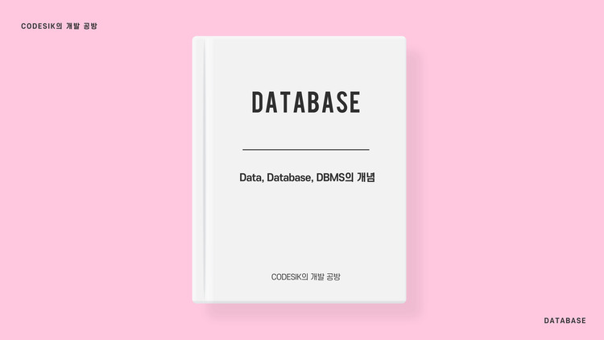

<p class="callout"> 💡[Database] Data, Database, DBMS의 개념</p>



> 본 포스팅은 한양대학교 컴퓨터소프트웨어 학부 데이터 베이스 시스템 과목에서 학습한 내용을 기반으로 함을 알려드립니다.

## Data
흔히 많이 들어본 데이터(Data)의 정의는, 다음과 같습니다.
> 기존에 알려져 있는 'Fact' 중 기록과 저장이 가능한 것

예를 들어서 이름, 주소, 핸드폰 번호 등이 있습니다.

---
## Database
데이터베이스란 쉽게 생각하면 데이터를 모아놓은 것인데, 좀 더 정확한 정의는 다음과 같습니다.

> 연관되어 있는 데이터가 논리적으로 연결된 집합

예를 들어, 한 회사의 연락처는 데이터베이스가 되는 겁니다. 핸드폰 번호라는 `Data`가 `Company`에 의해 같은 회사 사람의 데이터로 논리적 연결이 형성되면서 집합을 형성한 겁니다.

어렵게 설명했지만 쉽게 말하자면 `Mini world`의 개념으로 이해하시면 됩니다. 실제 세상에서, **어떤 한 면을 대표하는 것으로 생각하는 것**입니다. 이 느낌을 잘 가지고 있는 것이 중요합니다.

본 포스팅에서는 RDBMS(관계형 데이터베이스)를 다루며, SQL을 사용하지 않는 데이터베이스인 NoSQL도 있습니다.

RDBMS는 열과 행을 가진 테이블 형태입니다.

---

## DBMS(Database Management System)
DBMS는 프로그램(소프트웨어)의 집합이며, 유저가 데이터베이스를 매우 쉽게 관리할 수 있도록 합니다.

>데이터베이스를 관리하는 소프트웨어 중에서 **데이터베이스만을** 효과적으로 관리하기 위해 만들어진 전문적인 소프트웨어

RDBMS는 `Mysql` `MariaDB` 등이 있고
NoSQL 데이터베이스를 다루기 위한 DBMS는 `MongoDB`가 대표적입니다.

### DBMS의 특징
정확히 말하자면 이 특징은 다음과 같습니다.
> DBMS를 사용하지 않고 Low Programming을 통해 저장하는 방식과 비교할 때 DBMS의 장점

#### Self-Describing Nature
자신을 기술하는 특성이 있습니다. 이는 `Meta Data`를 가진다는 의미인데, 자신의 구조에 대한 정보를 데이터의 형태로 저장하는 것이다. 이는 코드의 형태로 구조에 대한 정보를 저장하게 되면(Class Structure 저장 방식) 프로그램까지 바꿔야 하므로 데이터의 형태로 저장하는 것이 굉장히 편하고, 쉽게 구조 변경이나 문제가 생겼을 때 해결이 가능합니다.

이는 데이터와 프로그램이 **독립적으로** 취급되는게 가능하다는 말입니다.

#### Data Abstraction
Detail을 감추고 핵심적인 내용만을 보여줍니다.

#### Support of multiple views of the data
데이터베이스를 여러 형태로 보여줄 수 있다는 말이며, 같은 데이터베이스를 다른 관점에서 볼 수 있다는 특징이 있습니다.

여러 부서에서 같은 데이터베이스를 쓰면서, 각 부서에서 보고 싶은 부분이 다를 수 있습니다. 그래서 각 부서에서 보고싶은 부분을 보여준다는 것이 View입니다.

#### Sharing of data
굉장히 많은 사용자가 동시에 데이터베이스에 접근하는 것을 막아줍니다. (Concurrency Control)

### DBMS가 제공하는 기능들

#### Controlling Redundancy
`Redundancy`는 같은 데이터가 multiple place에 저장된 것을 의미합니다. 이는 Data Consistency를 깰 수 있으므로 중요한 문제이며, 이를 컨트롤 해줍니다.

#### Restricting unauthorized access
권한이 없는 access를 제한시킵니다.

#### Persistent storage for program objects
프로그램이 끝나도 파일을 저장합니다.

#### Multiple user interfaces
다양한 인터페이스를 제공합니다. (CLI, GUI..)

#### Representing complex relationships among data
데이터 간 복잡하고 다양한 관계를 표현하는 것이 가능합니다.

#### Enforcing Integrity constraints
무결성을 제공합니다. 이 말은 강제로 결함이 없도록 해주는 것입니다. 예를 들어서

>회사의 경우 우리 회사는 나이가 20세 이상 65세 이하인 경우에만 일할수 있다.

이러한 Constraints를 만들고 위 조건을 위반하는 데이터는 저장하지 못하도록 하여 위반하지 못하도록 하는 것입니다. 또 다른 예로는 비밀번호의 저장 방식에 제한을 두는 방법 등이 있습니다.

---

## SQL
> DBMS를 통해 데이터베이스와 소통하기 위한 언어

SQL 문법에 대한 포스팅은 다음 포스팅에서 정리하도록 하겠습니다.

```toc
```
