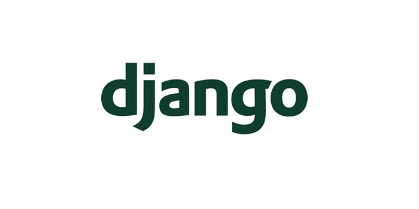

<p class="callout"> 💡[Django] Django의 ORM</p>


## ORM(Object Relational Mapping)
---
먼저 `ORM`이 뭘까요? 이름에서 알 수 있듯 간단히 말하면 `객체`와, `관계형 데이터베이스`를 `Mapping` 시켜주는 역할을 하는 녀석입니다.

`객체` <- 매핑(ORM) -> `데이터베이스 데이터`

로직을 구성하면서 CRUD를 위해 SQL을 작성할 필요 없이, 객체를 정의하고 ORM이 제공하는 Method를 사용하여 데이터베이스에 적재된 데이터를 쉽게 접근할 수 있도록 하는 것입니다. 이 과정에서 자동으로 SQL을 생성하면서 매핑이 되는 것 입니다! (편하죠?)

텍스트로만 보셨을 땐 이해가 잘 안되실 수도 있는데요, 코드를 보면 쉽게 이해하실 수 있으실 겁니다.

만약 ORM이 없으면 DB에 접근하는 비즈니스 로직마다 SQL을 작성해서 접근해야 하고, 이렇게 되면 비즈니스 로직이 너무 복잡해지고 간결성이 줄어듭니다. 또 팀 내에서 코드를 서로 이해하는데에도 큰 리소스가 듭니다.

저도 회사에서 Django 기반으로 서버가 구성되어 있어 ORM을 사용해 백엔드 로직을 작성하고 있는데, 너무 편합니다.

하지만 이런 ORM도 만능은 아닙니다. 오히려 복잡한 비즈니스 로직을 작성할 땐 성능을 저하시킬 수도 있기 때문에 설계를 잘하는 것이 매우 중요합니다.

일단 먼저 장단점부터 알아볼까요?
<br>
### 장점
---
> __편하고 직관적이어서 비즈니스 로직에 더욱 집중할 수 있다.__

* SQL문으로 데이터베이스에 접근하는 것이 아니라 클래스의 객체로 데이터를 조작하는 것이기 때문에 더 `객체지향적` 입니다.
* 좀 더 직관적이고, 비즈니스 로직에 더 집중할 수 있도록 해줍니다. 이로인해 생산성이 증가합니다.

> __재사용이 편하고 유지보수가 용이하다.__

* 각 객체를 한번 생성하면, 그 객체를 활용해 객체 안의 다양한 필드 값을 편하게 가져올 수 있어 재사용이 편리합니다.
* 또한 자주 사용하는 Query Set을 모델내에 정의하면 재사용이 편리합니다.

> __DBMS에 종속적이지 않다.__

* 매핑이 직관적이고, 잘 시켜놓으면 Native Query 없이 객체 메소드를 활용해 CRUD가 가능합니다.
* 데이터에 대한 가공 또한 파이썬, 혹은 자바의 기능을 이용함으로써 간결하게 가능합니다.


### 단점
---
> __ORM 만으로 서비스를 구축하는 것은 어렵다.__

* 서비스의 복잡성이 커질수록 설계를 매우 신중히 해야하며, 잘못 구현된 경우 SQL문이 비효율적으로 생성되어 성능을 저하시킬 우려가 있습니다.
* 복잡한 쿼리를 생성하는 것이 어려울 수 있습니다.
* 성능이 최적화된 쿼리 보다는 ORM에 최적화된 쿼리를 생성하기 때문에, 개발 중간에 성능을 저하시킬 수 있는 부분은 `row query`를 꼭 확인해서 어떻게 쿼리가 생성되는지 확인할 필요가 있습니다.

<br>
### ORM의 종류
---
ORM을 제공하는 Framework는 여러가지가 있는데, 대표적으로는 다음과 같습니다.

* Sequelize (Node.js)
* JPA/Hibernate (Java)
* Django ORM (Django 자체 제공)


## Django의 ORM
저는 이번 포스팅에서는, `Django`에서 자체적으로 제공하는 ORM에 대해서 소개드리려고 합니다.
먼저 위에서 `객체`와 데이터베이스를 이어주는 역할을 한다고 했었기 때문에, 가장 먼저 필요한건 모델(객체)를 정의하는 것입니다.

### 모델
Django의 모델은 데이터베이스에 매핑되는 객체입니다.
보통 하나의 모델은 하나의 테이블에 Mapping 되고, 클래스내의 Attribute 들은 테이블내의 필드를 나타냅니다.
가장 기본적인 예를 하나 들어볼게요.

person app을 하나 추가하고, setting.py에 어플케이션을 등록한 후 model 디렉토리 내에 model을 정의해볼게요.

`person.py`
```python
from django.db import models


class People(models.Model):
    name = models.CharField(
        verbose_name='이름', max_length=126, null=False
    )
    birth_date = models.DateField(
        verbose_name='생년월일'
    )
    wallet = models.ForeignKey(
        verbose_name='지갑', related_name='wallet',
        to='person.Wallet', on_delete=models.CASCADE, db_constraint=False
    )
```

`wallet.py`
```python
from django.db import models


class Wallet(models.Model):
    amount = models.IntegerField(
        verbose_name='잔액', default=0
    )
```

위 코드는 Person(사람)과 Wallet(지갑)이 1대다 관계로 매핑되어 있는 것을 나타냅니다.<br>
각 필드를 설정할 때마다 필드가 어떤 `Type`인지, 그리고 `ForeignKey`관계를 설정할 시 여러 옵션들을 줄 수도 있습니다.

먼저 어떤 테이블을 참조할지는 `to`에 지정해주면 되는데 보통 `app_name.Model_name` 으로 설정합니다. 안그러면 Circular import Error가 발생합니다.

위에서 설정한 `on_delete=models.CASCADE` 옵션은 삭제옵션으로, 해당 모델이 삭제 될 때 참조된 테이블의 열또한 함께 삭제하겠다는 설정이고, 다른설정들도 있습니다. (예를들어 DO_NOTHING으로 설정하면 참조 테이블의 열의 데이터를 삭제하지 않습니다. 무결성이 깨지기 때문에 잘 쓰진 않습니다.)

db_constraint는 안적으면 기본적으로 `True`가 default 값이고, `False`로 주게되면 데이터베이스 내에서 참조 무결성을 체크하지 않습니다. 이렇게 하면 `DoesNotExists` Exception이 코드내에서 발생할 가능성이 있습니다. (참조 실패)

위 옵션도 잘 쓰지는 않는데, ForeignKey 사용으로 인한 성능 저하를 막기 위해 무결성을 포기하더라도 Index 작업을 통해 성능을 올리기 위해 사용하는 경우도 있습니다. 다만 참조무결성이 훼손되니 Error Handling을 잘해줘야겠죠.

어쨌든 Model의 정의에 대한 더 다양한 옵션이나 방법들은 구글링을 통해 알아보시면 될 것 같습니다.

이렇게 모델을 정의를 했다면, 데이터베이스에 해당 변경사항을 알려주고 반영해야 합니다.
이 과정을 `Migration` 이라고 합니다.

### Migration
Migration 이란 모델의 변경, 수정사항을 데이터베이스 스키마에 반영하는 과정이라고 쉽게 이해하시면 됩니다.
또한 이런 수정내역 또한 migration 폴더 내에 app 마다 존재합니다. `Git`처럼 데이터베이스를 버전별로 관리할 수 있다는 장점도 가지고 있습니다.

Migration을 하는 방법은 manage.py의 command를 통해서 이뤄집니다.

제일 먼저 model을 정의했으니, migration 파일을 생성합니다.
```shell
python manage.py makemigrations person(app_name)
```
뒤에 app_name을 안넣으면 전체 app에 대하여 migration을 수행합니다.


app 내의 migration 폴더를 확인하면 이런식으로 생성된 걸 확인할 수 있습니다.
```python
class Migration(migrations.Migration):

    initial = True

    dependencies = [
    ]

    operations = [
        migrations.CreateModel(
            name='Wallet',
            fields=[
                ('id', models.BigAutoField(auto_created=True, primary_key=True, serialize=False, verbose_name='ID')),
                ('amount', models.IntegerField(default=0, verbose_name='잔액')),
            ],
        ),
        migrations.CreateModel(
            name='People',
            fields=[
                ('id', models.BigAutoField(auto_created=True, primary_key=True, serialize=False, verbose_name='ID')),
                ('name', models.CharField(max_length=126, verbose_name='이름')),
                ('birth_date', models.DateField(verbose_name='생년월일')),
                ('wallet', models.ForeignKey(db_constraint=False, on_delete=django.db.models.deletion.CASCADE, related_name='wallet', to='person.wallet', verbose_name='지갑')),
            ],
        ),
    ]
```

여기서 해당 명령어를 입력하면 DB에 마이그레이션이 어떻게 적용되어 있는지 app_name 별로 현황을 볼 수 있습니다. (안넣으면 다 보여줍니다.)

```shell
python manage.py showmigrations person(app_name)
```


해당 마이그레이션 파일을 적용시키려면, 밑 명령어를 입력하시면 됩니다.

```shell
python manage.py migrate person(app_name)
```
연결된 DB를 확인해보시면, 테이블과 필드가 생성되었음을 확인하실 수 있습니다.

여기서 어떤 SQL이 수행됐는지 확인하려면,

```shell
python manage.py sqlmigrate [app_name] [migration_number]
```
을 치면 어떤 sql이 수행됐는지 확인할 수 있습니다.

현업에서는 운영서버에 배포를 할 때 migration이 필요한 경우 sqlmigrate를 통해 적용할 sql을 확인하고 실제로 데이터베이스 내에서 수행하는 경우도 있습니다.


다음편에서는 이렇게 생성한 객체를 통해 데이터베이스에 어떻게 접근하여 데이터를 조작하는지에 대해서 포스팅하겠습니다.

```toc
```
