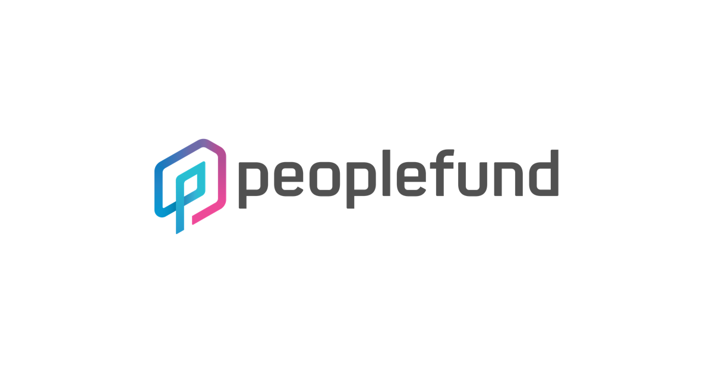

<p class="callout"> 💡피플펀드 인턴 면접 및 합격 후기</p>

## 인턴을 구하게 된 계기
저는 3학년 2학기까지 하고 1년동안 휴학을 하게 되었는데, 휴학을 한 목적은 명확했습니다.
* 3학년 동안 너무 열심히 달렸으니 조금만 쉬기
* 알고리즘 실력 쌓기
* 실무 개발 능력을 키우기

2월까지 하던 프로젝트를 마무리하고, 조금 휴식기를 가지면서 천천히 인턴을 구해보기 시작했습니다.
특히 저는 스타트업에서 일을 해보고 싶었습니다.
일을 배우는 입장에서, 대기업보단 스타트업과 같이 빠르게 성장하고 있는 회사에서 일하는게 더 많이 배울 수 있다고 생각했습니다.

아무래도 대기업 인턴은 과제를 주시거나, 묵어있던 과제를 해결하는데 초점이 맞춰져 있다고 들었었고
스타트업은 바로 일할 수 있는 사람을 뽑기 때문에, 제가 스타트업 인턴에 합격하게 된다면
그래도 그 자격이 약소하게나마.. 인정된게 아닐까 하는 생각이 들었었습니다.

대기업보다야 많은 트래픽을 다뤄보는 경험은 아니겠지만, 개개인이 서비스에서 담당하는 부분이 더 큰 것이
저에게는 메리트로 다가왔습니다.

## 인턴은 금턴이다.
인턴은 금턴이란 말이 있습니다. 특히 **채용연계형**이 아닌, **체험형**인턴은 더더욱 금턴입니다..
특히 대기업은 체험형인턴이 간간히 올라오는데, 스타트업은 거의 전무한 느낌입니다.

왜냐하면 스타트업에서는 대기업과 같이 신입 교육 시스템이 잘 갖춰져 있지 않은 경우가 대부분입니다.
이는 성장 위주의 경영에서는 어쩔 수 없는 부분이고, 스타트업에서는 구성원이 정말 중요한데
몇개월만 하고 나갈 인턴은 잘 뽑지 않는 경우가 대부분이죠..

그래서 더더욱 힘들었던 것 같습니다 🥲

## 피플펀드에 입사하는 과정

저는 2월 중순 쯔음에 한 코딩 교육 스타트업에서 감사하게도 좋게 봐주셔서 입사 오퍼까지 받아 입사예정일도 정해졌으나
개인적으로 그 시기에 입사하지 못할 사정도 있었고 또다시 교육쪽에 머물고 싶지 않은..마음에 거절을 드렸습니다.  

거절이란것이 정말 쉽지 않았었습니다. 개발팀장님께 장문의 편지를 드렸던 기억이 납니다..ㅎ

그 이후에 이제 정말 인턴을 구해야겠다는 생각이 들어 포지션 제안이 왔던 여러 회사와 면접을 봤었습니다.
하지만 마음에 드는 회사가 없어 거절을 하기도하고, 가보고 싶은 회사는 인턴을 채용을 안하기도 하고.. 떨어지기도 했습니다.

그렇게 어느덧 4월이 되어버렸고, 너무 많은 시간이 지난 것 같아 마음을 먹고 18개 정도의 회사에 새벽에 한번에 메일을 보냈습니다.
대충 이런 내용과 이력서를 같이 보내드렸습니다.
> 인턴을 하고 싶은데 채용 공고에는 인턴을 안뽑으시는 것 같아서요.. 혹시 채용 계획이 있으시다면 양식에 맞춰 재지원 하겠습니다.

안타깝게도.. 대부분의 회사에서 인턴을 안뽑으신다고 하셨습니다. 그나마 채용을 진행하게된 회사는 3개정도 있었고, 일단 서류는 붙었으나 코딩테스트를 남겨둔 상황이었습니다.

하지만 붙은 곳들은 그렇게 끌리는 곳들이 아니었었고.. (배가 불렀죠) 메일을 엄청 보낸 날 한 3일 후 새벽 4시쯤 피플펀드에 메일을 보내드렸던 것 같습니다.

피플펀드는 페이스북에서 블로그 글을 보고 알게됐었고, 그래서 평소에 알고있던 관심있는 핀테크 회사였습니다. 구성원 분들이 너무 뛰어나셔서 배울 점이 정말 많다고 생각했고, P2P 금융 업계 1위에 성장가능성도 커보였습니다. 블로그를 보면서 더 가고싶다는 생각이 들기도 했구요 ㅎ

[피플펀드 공식 블로그](https://blog.peoplefund.co.kr/)

그래서 갈 수 있으면 좋겠다.. 라는 생각을 했습니다.

### 이사님으로 부터 입사 제안
너무나 신기하게도 넣었던 회사 중 가고싶었던 회사가 있는데, 인턴을 따로 안뽑으신다고 하셔서 어쩔 수 없이 포기한 회사가 있었습니다.
근데 그 회사의 이사님께서 카톡으로 연락이 오셨습니다.

다름이 아니라 피플펀드에서도 이사진을 맡고계셔서, 이쪽 회사도 관심이 있다면 인턴을 지원해보는게 어떻겠냐고 하셨습니다.
그날 새벽에 메일을 보냈는데, 그날 아침에 이렇게 연락이 오다니 인연이 될 회사는 따로 있나..? 생각했습니다..ㅎ
이사님께는 정말 감사하다고 생각합니다.

채용프로세스를 진행하면서 서류를 합격하고, 면접까지 보게되었습니다.

### 면접.. 멘붕
면접 분위기는 정말 좋았습니다. 면접관님들도 정말 친절하시고 채용담당자님이 배려를 많이 해주신다는 느낌을 받았습니다.
처음에 들어갔는데 선물을 주셨습니다. 바로 `거짓말 탐지기` 였는데요.. 저는 이걸 받고 와 이런것도 챙겨주시는 구나!!


하고 감사하게 받았는데, 면접을 끝나고 생각해보니 면접은 거짓말을 탐지하는 과정이다.. 라는 깊은 뜻이 있지 않았을까 생각이 듭니다 ㅎㅎ;


대부분의 질문을 답을 잘한 것 같은데, 마지막쯤에 한 알고리즘을 구현하는걸 칠판에 수도코드로 적는 과정이 있었습니다.

음.. 문제는 공개하기 어려울 것 같아 말씀은 못드리지만, 솔직히 충분히 할 수 있는 문제였는데
너무 긴장하고 칠판에 그렇게 손코딩해본 경험이 처음이라서 너무 횡설수설했던 것 같습니다..ㅠㅠ

그래서.. 망했다고 생각을 하고 집에와서 육회에 소주를 한잔 말아먹었습니다.

### 합격 전화
다음날 채용담당자님께서 전화를 주셔서 아.. 떨어져서 전화를 주셨구나 했는데 붙었다고 하셔서 좀 많이 멍했습니다.
사실 자다 일어나서 받은거라 꿈이랑 좀 헷갈렸는데, 메일을 보고 실감이 났습니다.
제가 가고싶었던 회사에 입사하게 되어서 기분이 너무 좋습니다 ㅎㅎ

다음주에 입사를 하게 되었는데, 첫 회사생활이라 잘할 수 있을지 모르겠습니다. 그래도 주니어 개발자!!로서 정말 열심히 일해서
회사와 저의 팀에 기여할 수 있는 개발자로 성장하고 싶습니다.

## 인턴을 구하시는 분들에게 드리는 팁
스타트업에서 인턴을 희망하신다면 채용 공고에 없더라도 채용 메일로 이력서와 함께 여쭤보기라도 하는 것이 중요한 것 같습니다.
기회는 기다리면 생기는게 아니니까요!

최근 자존감이 많이 떨어져 있었는데, 이렇게 합격을 하고나니 자존감이 많이 올라간 것 같습니다.
인턴 채용을 거의 고려하지 않는 스타트업 업계에서 계약직 인턴으로 일을 하게 된 것 만으로도
어느정도 증명이 된 사람이 아닐까? 하는 합리화를 조금이라도 해보게 됐습니다 ㅎㅎ

물론 저는 너무나도 부족하지만, 앞으로 계속 성장해 나갈 예정입니다!!

```toc
```
