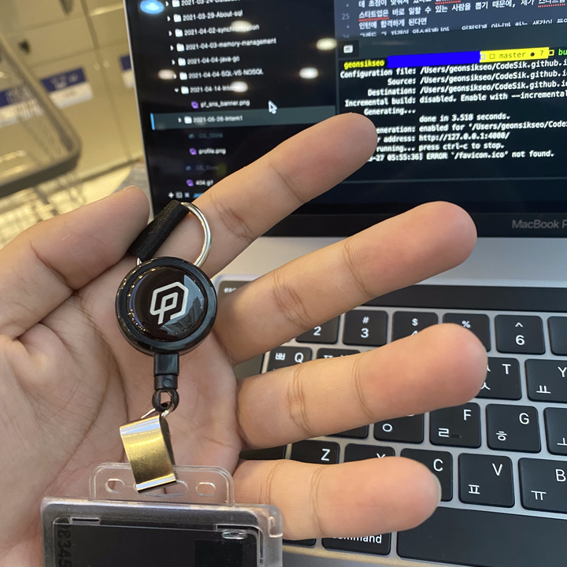

<p class="callout"> 💡피플펀드 인턴 1개월 차</p>

## 오랜만의 포스트
인턴 생활을 하게 되면 한달에 2번은 올리겠다고 다짐했지만.. 회사에 적응하느라 한달반동안 이제 처음으로 포스트를 쓰게됩니다..ㅎ

짧은 기간임에도 처음으로 현업을 접한 것이다 보니 배운게 정말 많고 쓰고싶은 포스트도 많지만, 일단 출근 4시간전에 빨래방에서 글을 쓰고 있어서 간단히 배운것들과 후기만 남기려고 합니다.

---

## 맡은 역할
자세한건 말씀드릴 순 없지만, 제가 다니는 회사는 P2P 대출을 주력 상품으로 내세우는 회사이기 때문에 돈의 흐름이 매우 중요합니다.

사실 어떤 서비스를 운영하는 회사던 간에 결제 시스템이 있다면 돈의 흐름을 관리하는 (정산, 이체 등) 로직은 어디에나 존재합니다.

그 중에서도 투자와 대출에 관련되어 있는 회사에 다니다 보니 그 로직을 관리하는 일은 매우 중요하다고 할 수 있습니다.

저는 핀테크 엔지니어링 그룹에서 정산, 상환 등의 돈의 흐름을 관리하는 백엔드 로직을 개발하는 역할을 담당하고 있습니다 :)

---

## 한달동안 해왔던 일


처음에는 너무 막막함 그 자체였습니다..

학교에서 과제를 하거나 개인적으로 친구들과, 혹은 혼자 프로젝트를 진행해봤던 경험과는 너무나도 간극이 컸습니다.

일단 규모가 너무 크고, 모듈도 많아 코드를 파악하는데 2주정도는 쓴 것 같습니다.

그리고 제가 개인적으로 작업했던 프로젝트를 AWS에 올려서 서비스를 하고있는데, 굉장히 보안에 취약하다는 생각을 많이 했습니다.

핀테크 스타트업이라서 보안이 정말 중요하기 때문에 AWS에 인스턴스를 올릴 때 고려해야할 상황이 정말 많았습니다. 그냥 넘어갔던 보안 그룹(제 프로젝트는 다 열어놨었습니다..), 로드밸런서, CI 시스템, Git otp 접근 등..

현업에서 코드를 어떻게 관리하고 네트워크 구축은 어떻게 되어있는지 파악하고 나니 그동안 제가 작업했던 결과물들이 초라해지더군요..ㅎ 아직 배울게 정말 많다는 생각이 들었습니다.

그렇게 한달동안 아키텍처의 구조도 파악하고, 코드도 파악하고, 회사 직원분들이랑 친해지는 시간도 가지고, 개인적으로 Django를 회사에 와서 처음써봐서 주말에는 공부하는 시간을 좀 가졌습니다.

### 첫 기능 개발
코드의 구조를 파악하기 좋은 사내 메신저(슬랙) 알림을 만드는 기능을 개발했습니다.

자세히는 말씀을 못드리지만, 대충 사내 정산시스템에서 문제가 생긴 경우나 정산 현황에 대해서 알림을 줄 수 있는 기능을 맡게 되었습니다.

저는 Git을 쓸 때 곧이 곧대로 그냥 master 브랜치에 다 때려박는 아주 안좋은 습관이 있었는데.. 이번 기능을 개발하면서 `Git Flow`에 대해서 알게 되었고 그 중요성을 깨달았습니다. 이 부분은 따로 자세히 더 공부해서 포스팅을 해볼 예정입니다.

현업에서 Git을 사용하는 방법을 글로만 봤을 땐 전혀 이해를 못했는데, 실제로 해보니까 이해가 너무 잘됐었습니다. 그렇게 첫 PR을 날리고 develop에 merge 됐을 때 쾌감이 너무 좋았습니다..ㅎ

그 이후로는 `Quick Fix Issue` 들이 나오면 배정받아서 계속 PR을 날렸고, 지금도 계속 처리를 하면서 코드의 구조에도 익숙해지고 대충 어떻게 돌아가는지는 파악이 된 것 같습니다. 아직 많이 부족하지만요..

---

## 다짐
곧 출근이라.. 얼른 쓰고 마쳐야겠습니다.

회사 생활을 하면서 느끼고 깨달은게 정말 많은데, 잊어버리기 전에 빨리 글로 남기지 않으면 날려 버릴 것 같아 좀 초조한 느낌입니다. 이번 주말에는 피곤하다고 디비 자지 않고 그동안 배운 것들, 그리고 지금 개발을 할 때 필요한 스킬들에 대해서 좀 포스팅을 해볼까 합니다.

인턴이 끝나는 시기에는, `백엔드 개발자`라고 불릴 수 있을 만큼 성장해 있었으면 좋겠네요 ㅎ

```toc
```
