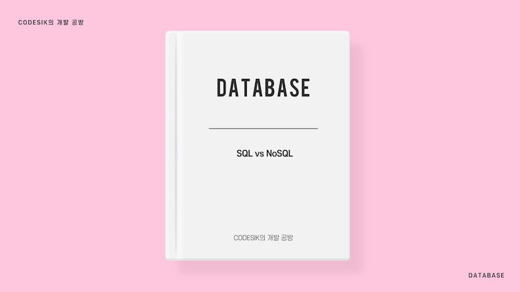

<p class="callout"> 💡[Database] SQL과 NoSQL의 비교</p>

## SQL

SQL이란 Structured Query Language 입니다. RDBMS(관계형 데이터베이스 관리 시스템)과 상호 작용을 하기 위한 언어이며, 데이터베이스가 아닙니다. 어쨌든 중요한건 SQL는 관계형 데이터베이스를 다룰 때 사용한다는 것입니다.

**RDBMS에는 두가지의 중요한 특성이 있습니다.**

- 데이터는 정해진(엄격한) 데이터 스키마 (= structure)를 따라 데이터베이스 테이블에 저장됩니다.
- 데이터는 관계를 통해서 연결된 여러개의 테이블에 분산됩니다.

### 엄격한 스키마

데이터는 Table에 Record로 저장이 되며, 명확하게 정의된 Schema가 존재합니다. Schema는 구조이며, 이 구조에 적합하지 않은 Record는 Table에 추가할 수가 없습니다. 그래서 `엄격한` 이란 표현을 쓰는겁니다.

### 관계

이름에서부터 알 수 있듯이 `관계형 데이터베이스` 입니다. 각 테이블마다 관계를 맺고있다는 뜻입니다. 이게 중요한 이유는 중복을 피할 수 있다는 것입니다. 그 관계는 Foregin Key와 Primary Key로 구현을 합니다. 예를들어서 어떤 유저가 어떤 주문을 했는지를 조회하고자 해봅시다. 만약 테이블마다 관계를 맺을 수 없다면 유저 테이블에 어떤 주문을 했는지를 표시해야 할 것이고, 주문 테이블에 유저의 정보를 모두 넣어줘야겠습니다.

하지만 명확하게 한개로만 구분되는 Primary Key(id..etc)를 Foregin Key로 가져와 관계를 맺을 수 있다면, 서로 테이블간 레코드가 중복될 필요 없이 데이터를 조회할 수 있습니다. `Join` 연산을 사용해서요.

---

## NoSQL

NoSQL은 이름처럼 SQL과 반대의 방식으로 데이터베이스에 접근하기 때문에 지어졌습니다.

SQL의 주요한 특성인

- 스키마
- 관계

이 두 개가 없습니다.

이 두 개가 없다는 말은 곧, 스키마(구조)를 따르지 않고 데이터를 `Collection(RDBMS의 테이블)` 에 추가할 수 있습니다.

관계가 없기 때문에 `Join` 의 개념또한 없습니다. 위에서 설명했던 유저와 주문의 관계를 살펴본다면, 주문이라는 컬렉션의 모든 유저의 정보를 같이 저장하는 겁니다.

위 방식은 데이터가 중복되기 때문에, 중복되는 데이터를 수정하는 경우 모두 다 업데이트 되도록 하는 것이 중요하다고 할 수 있습니다. 그래서 자주 변경되지 않는 데이터 일 때 큰 장점이 있습니다.

---

## 두 데이터베이스의 비교

### 수직적 vs 수평적 확장(Scailing)

데이터베이스의 확장성이 어느 방향에 있냐에 따라서 두 데이터베이스가 나뉘게 됩니다.

- **수직적 확장**은 데이터베이스 서버의 성능을 향상시키는 겁니다. (CPU 등의 하드웨어 교체)
- **수평적 확장**은 서버를 분산시키는 것을 의미합니다.

`RDBMS` 에서는 수직적 확장만 가능합니다. 수평적 확장(Sharding)을 할 수는 있지만 구현하는게 굉장히 까다롭습니다. `NoSQL`에서는 이를 기본적으로 지원하므로 서버를 더 많이 추가하여 분산시키는 것이 가능합니다.

## 각 데이터베이스의 장단점

둘 중 뭐가 낫다는 없습니다. 구현해야할 상황에 따라서 어떠한 데이터를 다루는지, 어플리케이션이 어떠한 특징을 가지고 있는지에 따라서 유연하게 선택해야합니다.

### SQL의 장단점

**장점**

- 스키마를 명확히 정의하여 무결성 보장
- Record의 중복이 없음

**단점**

- `NoSQL`에 비해서 상대적으로 덜 유연하기 때문에 나중에 수정이 번거롭다. 불가능할 수도 있다.
- Join문이 많은 복잡한 쿼리가 만들어 질 수 있다.
- 수평적 확장이 어렵고 대체로 수직적 확장만 가능하다. 이렇게 되면 어느 시점에서 한계점에 직면할 수 있다.

### NoSQL의 장단점

**장점**

- 스키마가 없어 굉장히 유연하다. 언제든지 구조에 신경쓰지 않고 새로운 `Document` 를 추가할 수 있다.
- 데이터는 어플리케이션에서 요구하는 형식으로 저장되기 때문에 데이터를 읽어오는 속도가 빨라진다.
- 수직적, 수평적 확장이 모두 가능하다.

**단점**

- 유연함 때문에 오히려 데이터의 구조가 제대로 안정해질 수도 있다.
- 중복된 데이터가 변경되면 중복된 데이터가 있는 여러개의 `Collection`에서 변경이 이뤄져야 한다.

## 각각은 언제 사용하는 것이 좋을까?

### SQL

- 데이터가 자주 변경되어야 하는 경우(NoSQL은 컬렉션을 모두 수정해야 하기 때문에)
- 구조가 변경될 여지가 없으며 명확한 스키마를 정의하는 것이 사용자와 데이터에게 중요한 경우

### NoSQL

- 정확한 데이터 구조를 몰라 변경, 확장이 될 수 있는 경우
- 조회는 많이 하지만 데이터의 변경이 자주 있지 않는 경우
- 데이터베이스를 수평적으로 확장해야 하는 경우, 즉 굉장히 많은 양의 데이터를 다뤄야 하는 경우


```toc
```
