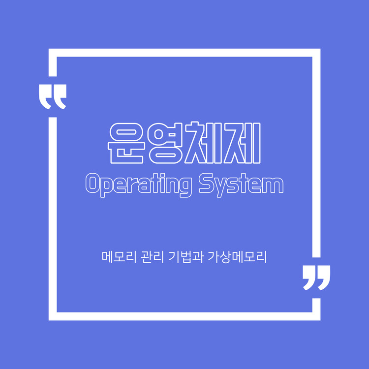

 💡[OS] 메모리 관리 기법과 가상 메모리

> 본 포스팅은 한양대학교 컴퓨터소프트웨어학부 유민수 교수님의 운영체제 과목 강의 자료와 수업내용을 참고하였습니다.

## 메모리 관리 기법과 가상 메모리

가상메모리를 설명하기 위해서는 OS의 메모리 관리 기법에 대해서 알고있어야 합니다.

CPU는 스케줄링 알고리즘을 통해서 메모리에 올릴 프로세스를 선택하게 됩니다. 이 과정에서 메모리의 관리는 OS에서 아주 중요한 부분이죠.

## 메모리 관리 기법의 두가지 목적

1. 프로세스 별로 하나의 단일하고 연속적이고, 보호가 되는 메모리의 공간을 할당하기 위함.
2. 실제 물리적 메모리 공간보다 더 많은 공간을 사용하기 위해서

---
## 메모리 관리 기법
### 연속적 Address Binding

- Address Binding

    특정 메모리의 주소에 코드와 데이터를 적재하는 것.

- 연속적인 메모리의 할당

    1번 목적이 기억나시나요?

    CPU는 연속적인 메모리의 할당을 요구합니다.
    

    이런식으로 프로세스간에 연속적으로 메모리를 할당하도록 하게 되어있고, 남는 공간은 hole로 비워두는 기법입니다. 다만 연속적 메모리 할당의 단점은 Hole이 너무 작게 형성 되는 경우 프로세스가 할당되지 않게 되어 낭비가 됩니다.

---

### 비연속적 Address Binding

- 💡아이디어(Address Translation) 
    프로그램(CPU)은 Logical address를 사용하고, OS나 HW는 이를 하드웨어가 사용하는 Physical address로 변환합니다. 이렇게 Address Translation을 하게되면 비연속적인 메모리 할당이 가능해지며, Flexibility가 높아집니다.
     
- Address Translation 
    `Address Translation` 과정은 Logical Address를 Physical Address로 변환하는 과정이며, `MMU(Memory - Management Unit)`를 통해 수행할 수 있습니다. 이는 CPU와 Memory 사이에 있는 Relocation Register입니다. 하드웨어의 서포트를 받는것이죠.

#### 비연속적으로 메모리를 할당하는 두가지 기법
그렇다면 비연속적으로 메모리를 할당하는 기법에 대해선 뭐가있을까요? 대표적으로는 두가지가 있습니다.

- Segmentation

    메모리에 배정하는 단위를 `Segment`를 베이스로 하는것입니다. Process는 Text, Data, Stack등 다양한 영역으로 나눠져있는데, 각각의 영역을 Segment로 나눠서 메모리에 Address Translation 과정을 통해 할당하는 것입니다. 이렇게 되면 각 Segment가 다른 사이즈를 가지고 있다는 것을 알 수 있습니다.

> 프로세스의 구조 
사진 출처: https://zoomkoding.github.io/os/2019/04/20/os-3.html

    스케줄러에 의해 `Context Switching` 이 될 때 Process의 세그먼트 별 시작주소 값을 Memory Relocation Register에 저장하여 할당합니다.

    이렇게 되면 Hole의 크기가 작아도 배정이 가능해져서 문제가 줄어들게 됩니다. 다만 Page 저장 방식에 비해서 Hole이 어느정도 존재하게 되겠죠.

    
   

- Paging

    `Page`란 동일한 일정 크기의 메모리 영역이며, 메모리에 Page 단위를 베이스로 하여 비연속적으로 할당하는 방법입니다. Process를 일정한 Page라는 단위로 나누는 것입니다.

    Page는 `Frame`이라는 용어와 연관되어 있는데, Page는 Virtual Address Space의 Block이고 Frame은 Physical Address Space의 Block입니다. 그래서 `VAS(Virtual Address Space)`에서 `PAS(Physical Address Space)`로의 Mapping을 통해 메모리에 할당합니다. 이때 Memory Relocation Register를 사용하는데, Segmentation에 비해서 굉장히 큰 비용이 듭니다. 그래서 OS에서는 `Page Table`을 통해 비용을 줄였는데, 이에 대해서는 다른 포스팅에서 다루겠습니다.

    

---

### Demand Paging
모든 프로세스가 물리적인 메모리에 할당되는 방식은 너무 비효율적 입니다. 그래서 메모리 공간의 Utilization을 높이기 위해서 다양한 방법을 사용할 수 있습니다.

* Dynamic Loading
* Overlays
* Dynamic Linking
* Swapping
* Demand Paging

`Demand Paging`은 Paging 기법에 기안한 방법으로, Paging 기법은 모든 프로세스가 물리적인 메모리에 할당되어야 했으나 `Demand Paging`은 실행되는 것만 메모리에 저장하자. 입니다.

Demand Paging 메커니즘에 대해서 설명하기 위해서는 위에서 설명한 `Swapping` 에 대해서 알아야 하며, 간략히 말하자면 Page 단위로 Swap Out & In이 진행되는 것입니다.

간단하게 Swapping에 대해서 알아봅시다.

#### Swapping
메모리가 부족하게 되면 Active하지 않은 프로세스의 실행을 중단하고, 그 프로세스의 이미지(코드, 실행당시 Data)를 그대로 하드디스크에 씁니다. 이 과정이 `Swap Out`입니다.

나중에 이 프로세스들이 Active되면 하드디스크에서 메모리로 복사하는데, 이 과정이 `Swap In`입니다.

이 기법은 성능이 많이 느립니다. I/O 작업(Memory Access)을 해야하기 때문입니다.

##### Demand Paging과 가상메모리
위의 Swap Out & In을 Page 단위로 하는것입니다. Swapping과 다르게 Page단위로 Swapping이 일어나기 때문에 Process가 종료되지 않습니다.

여기서 가상메모리에 대한 내용을 이해할 수가 있습니다.

만약에 메인메모리의 크기가 100MB이고, 200MB크기의 프로세스를 실행시키려면 불가능할 것 입니다. 하지만 위에서 말한 Page 단위로 프로세스를 쪼개고, 필요한 Page만 메모리에 적재하게 되면 프로세스를 실행시킬 수 있는 것입니다. 이게 가상메모리의 개념입니다. 실제 물리적 메모리의 제약을 없애고 더 많은 프로세스를 실행시킬 수 있는 것입니다.

Swapping의 개념과 거의 비슷하다고 보시면 됩니다. 그 단위가 Page라고 생각하면 됩니다.

#### Active한 Page를 판별하는 방법
Swap Out & In이 Active한 Page를 구별해서 일어난다는 것은 알았는데, 어떻게 아는걸까요?
Demand Paging의 Trigger 역할을 하는 메커니즘은 `Page Fault`입니다.

Page Table은 Logical Memory(Page)와 Physical Memory(Frame)의 매핑 정보를 담은 Table인데, 여기에 `valid - invalid Bit`을 추가합니다.(1bit)

초기에는 모두 Invalid로 설정되어있고, 이 비트가 Page 주소를 참조하려 할때 Invalid면 Page Fault가 발생하여 Swap In 후 Valid한 것으로 바꿔줍니다.

쉽게 말하자면 스케줄러가 Page 주소를 참조하려 한다는 것은 `Active`하다는 것입니다. 필요하다는(Demand) 것이죠. 그래서 Page Table을 살펴봤더니 아직 메모리에 적재가 안된것입니다. (Invalid) 그래서 Page Fault가 발생하고, Backing Store에서 페이지를 가져와 실제 메모리에 적재를 마치고 Valid로 바꿔줍니다.

이렇게 되면 Logical Memory(Page)와 Physical Memory(Frame)의 매핑정보를 담은 Page Table에, 실제로 메모리에 적재되었는지 여부까지 알 수 있게 되는 것이죠.

#### Page Replacement (Frame이 다 배정되었을 때)
이렇게 Swap In을 통해 물리 메모리에 모든 Page를 적재해서 공간이 없어졌는데 Page가 필요하게 되면 어떡할까요?

`Victim Frame`, 즉 희생할 이미 배정되어 있는 Frame을 선택해서 Swap Out하고 필요한 Page를 Swap In해야겠죠? 이 과정이 `Page Replacement`입니다.

정리하자면, Page Replacement의 과정은 다음과 같습니다.
  1. 디스크에서 필요한 Page를 찾는다.
  2. Victim Frame을 선정하고 Swap out
  3. 필요한 Page를 Swap In

중요한 부분은 `Victim Frame`을 어떻게 선정해야 할것인가? 입니다. 알고리즘이 굉장히 중요하고 성능에 영향을 미칩니다. 오랫동안 사용되지 않은 Frame을 잘 선정하는 것이 중요하죠.

본 포스팅에서는 자세히 설명하진 않지만 알고리즘에는 다음의 알고리즘들이 존재합니다.

* FIFO
  가장 먼저 들어온 Frame을 Victim 으로 선정
* Optimal Algorithm
  가장 이후에 참조될 Frame을 Victim 으로 선정
* LRU(Least Recently Used Algorithm)
  가장 오래전에 참조된 것을 Frame을 Victim 으로 선정
* Counting Algorithm
  시간이 아닌 `빈도`를 기준으로 Victim Frame 선정
  * LFU(Least Frequently Used)
  * MFU(Most Frequently Used)

성능이 가장 좋은 것은 `Optimal Algorithm` 이지만, 미래에 어떤 Frame이 설정될 지는 알 수 없어서 구현이 어렵습니다. 그래서 성능을 비교하기 위해 사용합니다. `FIFO` 알고리즘은 성능이 안좋고, `LRU` 알고리즘은 가장 성능이 좋습니다. Counting Algorithm은 흔하지 않습니다.

`LRU` 알고리즘의 실제 구현 또한 어려우나 하드웨어를 추가적으로 사용하여 비슷한 알고리즘을 구현할 수 있습니다. (언제 참조됐는지를 기록할 Register)

* Reference Bit
* Additional Reference Bits
* Second Chance
